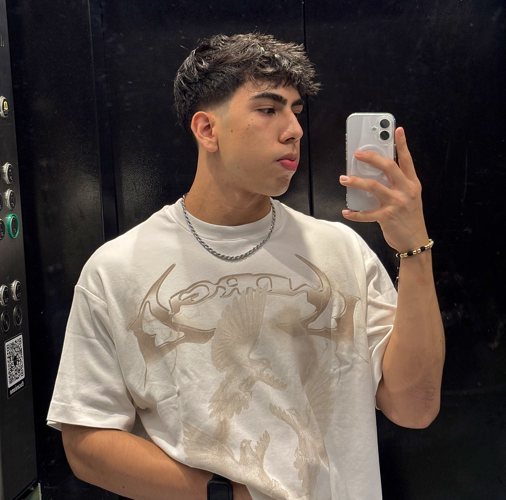

# 🛍️ UNAB Shop

### Creado por: **Noel Santiago Méndez Jaimes**

---

## 🎯 Descripción

**UNAB Shop** es una aplicación moderna y práctica diseñada para que los estudiantes, egresados y visitantes de la **Universidad Autónoma de Bucaramanga (UNAB)** puedan **comprar fácilmente el merchandising oficial de la universidad**.

Desde camisetas, termos, gorras, cuadernos y más, esta app reúne todos los productos que representan el orgullo y la identidad UNAB.  
Los usuarios podrán explorar los diferentes artículos, guardarlos como favoritos y realizar sus compras de forma cómoda y segura.

---

## 🚀 Características principales

- 🧢 **Catálogo visual** – Explora productos oficiales con imágenes, precios y descripciones detalladas.  
- ❤️ **Favoritos personalizados** – Guarda tus artículos preferidos para verlos más tarde.  
- 🛒 **Carrito de compras** – Agrega productos y gestiona tus compras en segundos.  
- 🔍 **Búsqueda inteligente** – Encuentra fácilmente lo que buscas por nombre o categoría.  
- 💳 **Compra sencilla** – Proceso rápido, intuitivo y adaptado a dispositivos móviles.

---

## 🎨 Objetivo del proyecto

Brindar una experiencia digital atractiva, simple y funcional para que la comunidad UNAB pueda adquirir sus productos favoritos y fortalecer su sentido de pertenencia con la universidad.

UNAB Shop busca **modernizar la forma en que los estudiantes interactúan con la tienda universitaria**, conectando la pasión por su institución con la tecnología.

---

## 💡 Tecnologías utilizadas

- **Frontend:** [Indica aquí tu framework o lenguaje, por ejemplo React / Flutter / Java Swing]  
- **Backend:** [Ejemplo: Node.js / Java / Python]  
- **Base de datos:** [Ejemplo: MySQL / Firebase / PostgreSQL]

---

## 👏 Créditos

Desarrollado con dedicación por  
**Noel Santiago Méndez Jaimes**  
Estudiante de la Universidad Autónoma de Bucaramanga (UNAB)

---
✨ *UNAB Shop – Viste tu orgullo, compra con estilo.*
